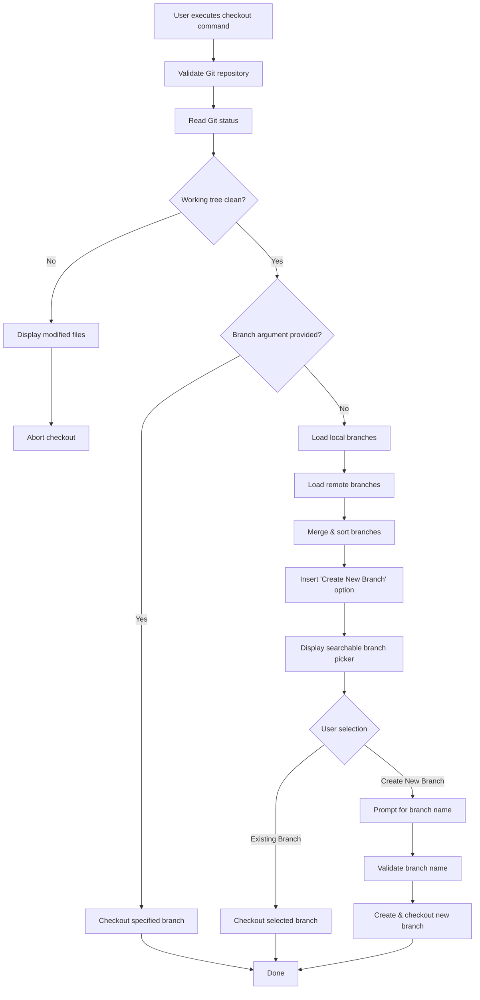
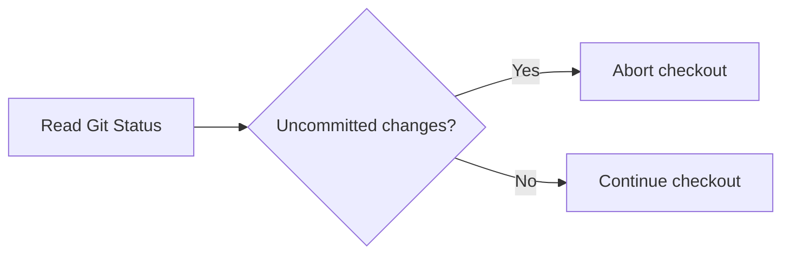
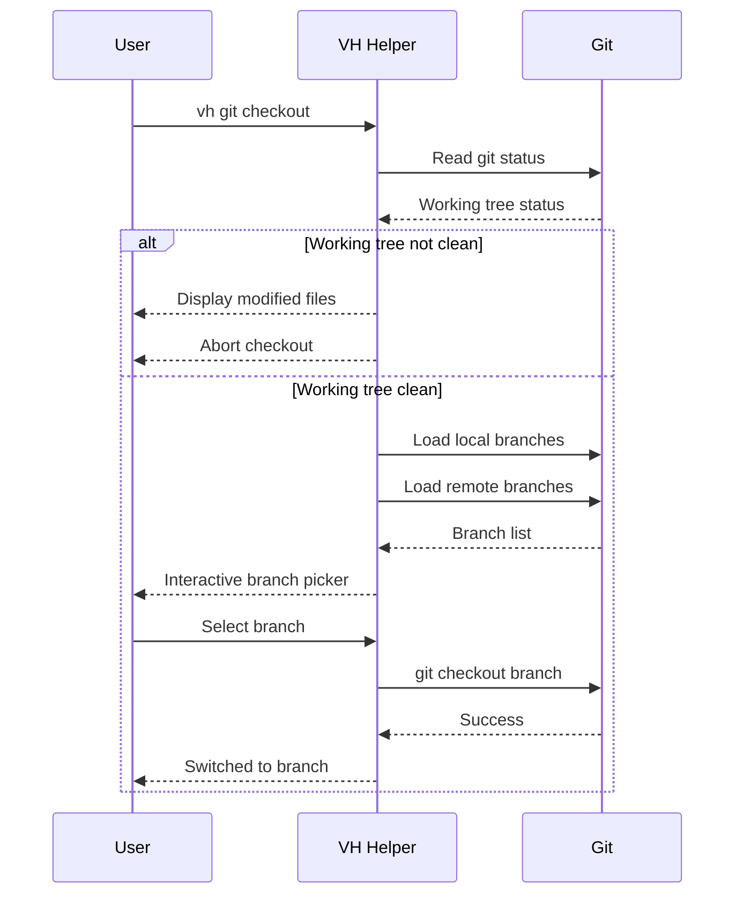
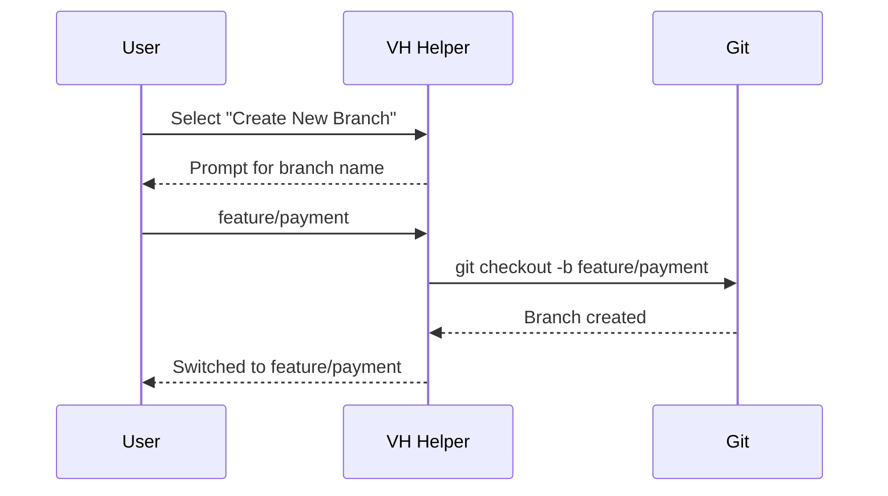

# Git Checkout Command

## Overview

The `vh git checkout` command allows users to switch to an existing Git branch or create a new branch through an interactive terminal interface.

Unlike the native Git command, VH Helper provides a searchable branch picker that makes branch discovery easy and reduces typing mistakes.

The first option in the branch selector is always **Create New Branch**, allowing users to quickly create and switch to a new branch.

---

# Command Syntax

```bash
vh git checkout [branch]
```

```bash
vh git checkout -b <branch>
```

---

# Supported Modes

| Command                            | Description                            |
| ---------------------------------- | -------------------------------------- |
| `vh git checkout`                  | Opens the interactive branch selector. |
| `vh git checkout main`             | Checks out an existing branch.         |
| `vh git checkout -b feature/login` | Creates and checks out a new branch.   |

---

# Workflow



---

# Interactive Mode

Running

```bash
vh git checkout
```

opens an interactive searchable list.

```text
Search branch...

❯ ➕ Create New Branch

  main
  develop
  feature/expo
  release/v1
```

The user can type to instantly filter the list.

Example:

```text
Search branch...

> fe
```

Result

```text
❯ feature/expo
  feature/login
```

---

# Branch Ordering

Branches are displayed in the following order.

1. Create New Branch
2. Current Branch
3. Local Branches
4. Remote Branches

Example

```text
➕ Create New Branch

────────────────────

✓ new-vh

main

develop

────────────────────

origin/main

origin/develop

origin/feature/expo
```

---

# Working Tree Validation

Before switching branches, VH Helper validates that the current working tree is clean.

This prevents accidental loss of uncommitted work and follows Git's recommended workflow.



If changes are detected, checkout is aborted.

Example:

```text
Cannot switch branches.

The following files contain uncommitted changes:

• src/features/git/git.controller.ts
• package.json

Please commit, stash, or discard your changes before switching branches.
```

---

# Creating a Branch

When **Create New Branch** is selected, VH Helper prompts for a branch name.

```text
Branch Name

❯ feature/payment
```

VH Helper executes

```bash
git checkout -b feature/payment
```

---

# Direct Checkout

Checkout an existing branch.

```bash
vh git checkout develop
```

Equivalent Git command:

```bash
git checkout develop
```

---

# Create Branch

Create and switch to a new branch.

```bash
vh git checkout -b feature/login
```

Equivalent Git command:

```bash
git checkout -b feature/login
```

---

# Internal Checkout Flow



---

# Create Branch Flow



---

# Features

- Interactive branch picker
- Live branch search and filtering
- Direct checkout by branch name
- Create and checkout new branch
- Working tree validation before checkout
- Supports local branches
- Supports remote branches
- Current branch highlighting
- Git-compatible command syntax
- Fast interactive workflow
