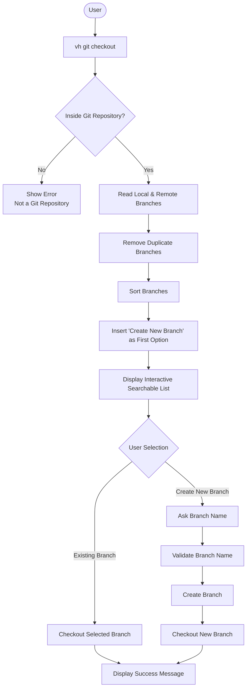
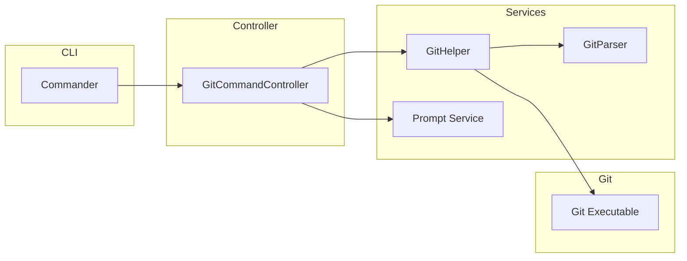
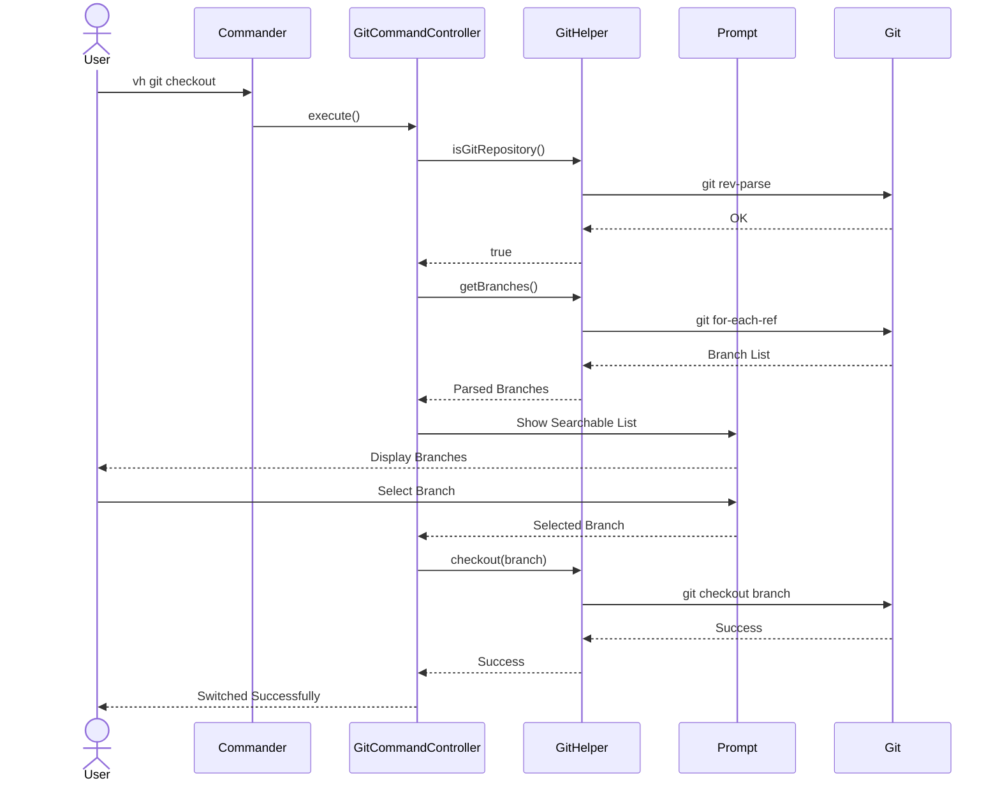

# Git Checkout Command

## Overview

The `vh git checkout` command allows users to switch to an existing Git branch or create a new branch through an interactive terminal interface.

Unlike the native Git command, VH CLI provides a better user experience by displaying all available branches in a searchable interactive list. This reduces typing errors, improves discoverability, and makes branch management easier for both beginners and experienced developers.

The first option in the branch selector is always **Create New Branch**, allowing users to quickly create and switch to a new branch without remembering Git syntax.

---

# Goals

- Simplify branch switching
- Provide an interactive searchable branch list
- Reduce typing mistakes
- Support branch creation
- Support local and remote branches
- Provide meaningful error messages
- Keep the workflow beginner friendly

---

# Supported Features

- Interactive searchable branch list
- Local branch checkout
- Remote branch checkout
- Create new branch
- Automatic tracking branch creation
- Current branch highlighting
- Keyboard navigation
- Success and error messages
- Graceful cancellation

---

# Command Syntax

```bash
vh git checkout
```

Future syntax

```bash
vh git checkout <branch>

vh git checkout --new <branch>

vh git checkout --remote <branch>
```

---

# User Flow



---

# Component Architecture



---

# Responsibilities

## Commander

Responsibilities

- Register checkout command
- Parse CLI arguments
- Parse command options
- Invoke controller

---

## GitCommandController

Responsibilities

- Verify repository
- Read available branches
- Launch prompt
- Process user selection
- Handle validations
- Execute checkout
- Display result

---

## GitHelper

Responsibilities

- Execute Git commands
- Parse Git output
- Create branches
- Checkout branches
- Validate repository
- Validate branch existence

Main APIs

```ts
isGitRepository();

getBranches();

checkout();

createBranch();

branchExists();

fetch();
```

---

## GitParser

Responsibilities

- Parse Git output
- Normalize branch information
- Remove invalid entries

---

## Prompt Service

Responsibilities

- Display searchable list
- Capture keyboard input
- Search filtering
- Text input
- Confirmation prompts

---

# Sequence Diagram



---

# Business Rules

- User must be inside a Git repository.
- Duplicate branches must not be shown.
- Current branch should appear at the top.
- "Create New Branch" must always be the first option.
- Remote branches should be clearly identified.
- Invalid branch names must be rejected.
- Existing branch names cannot be reused.
- User may cancel at any time.

---

# Validation Rules

## Repository Validation

Validate

- `.git` directory exists
- Current directory belongs to a Git repository

---

## Branch Validation

Validate

- Branch exists
- Duplicate branches removed
- Current branch highlighted
- Remote branches identified

---

## New Branch Validation

Validate

- Not empty
- Valid Git reference
- Branch does not already exist
- No illegal characters
- No trailing spaces

Invalid examples

```
feature..

feature~

feature^

feature:

feature?

feature*

```

---

## User Input Validation

Reject

- NULL characters
- Escape characters
- Control characters
- Empty input

---

# Edge Cases

## Not a Git Repository

Output

```
Not a Git repository.
```

---

## No Branches Found

Output

```
No branches available.
```

---

## Detached HEAD

Display

```
Detached HEAD
```

Allow checkout.

---

## Branch Already Exists

Display

```
Branch already exists.
```

---

## Invalid Branch Name

Display validation error.

---

## Checkout Blocked

Git refuses checkout because of uncommitted changes.

Display Git error.

---

## Merge Conflict

Display

```
Checkout failed due to unresolved conflicts.
```

---

## Remote Branch Only

Prompt

```
Create tracking branch?
```

Execute

```bash
git checkout --track origin/feature/login
```

---

## Empty Branch Name

Prompt again.

---

## User Cancels

Display

```
Operation Cancelled
```

---

# Error Handling

| Error              | Action                |
| ------------------ | --------------------- |
| Repository Missing | Stop execution        |
| Invalid Branch     | Show validation error |
| Branch Exists      | Ask again             |
| Git Failure        | Display Git error     |
| Checkout Failed    | Show failure message  |
| User Cancelled     | Exit gracefully       |

---

# Examples

## Checkout Existing Branch

```bash
vh git checkout
```

```
Search Branch

> feature/login

✔ Switched to feature/login
```

---

## Create New Branch

```bash
vh git checkout
```

```
Search Branch

> Create New Branch

Branch Name

feature/payment

✔ Created and switched to feature/payment
```

---

## Checkout Remote Branch

```
origin/feature/api
```

↓

```
Create tracking branch?

Yes
```

↓

```
✔ Switched to feature/api
```

---

## Repository Missing

```bash
vh git checkout
```

```
Not a Git repository.
```

---

# Exit Codes

| Code | Meaning          |
| ---- | ---------------- |
| 0    | Success          |
| 1    | Validation Error |
| 2    | Git Error        |
| 3    | User Cancelled   |

---

# Dependencies

- Commander.js
- Git
- GitHelper
- GitParser
- Prompt Service

---

# Future Improvements

## Favorite Branches

Display recently used branches first.

---

## Branch Categories

```
Feature

Bug

Release

Hotfix
```

---

## Branch Preview

Display

- Last Commit
- Commit Author
- Last Updated
- Ahead / Behind
- Tracking Branch

before checkout.

---

## Fuzzy Search

Example

```
pay

↓

feature/payment-api
```

---

## Auto Fetch

Automatically fetch latest remote branches before showing the list.

---

## Git Worktree Support

Detect worktrees and display available worktrees.

---

## Branch Icons

```
★ Current

⬆ Ahead

⬇ Behind

☁ Remote

🌱 Local
```

---

## Multi Repository Mode

Allow repository selection when inside a workspace containing multiple repositories.

---

## Recently Used Branches

Maintain checkout history and prioritize recently visited branches.

---

# Related Commands

- `vh git branch`
- `vh git status`
- `vh git fetch`
- `vh git pull`
- `vh git push`
- `vh git merge`
- `vh git rebase`
- `vh git stash`
- `vh git commit`
