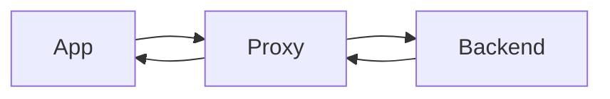
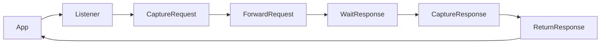
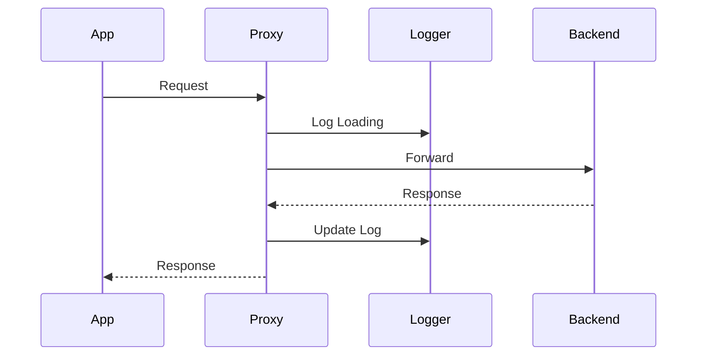

# HTTP PROXY

## 1. Overview

Proxy feature help the users to route application traffic through vh cli.
Every request and response is captured making debugging and api documentation easier.

## 2. Problem

Currently developers use dev tools or external proxy to tools to inspect requests.
Theme tools don't automatically generate engineering documents.
VH Proxy aims to capture network traffic and generate reusable artifacts directly inside the project.

## 3. Goals

- Capture requests
- Capture responses
- Show pending requests
- Generate API documentation
- Keep request history

## 4. User Story

As a developer,

I want to run one command,

so that all HTTP requests are automatically captured and documented.

## 5. Commands

`vh proxy http://localhost:5002`

Expected output

```Proxy Started

Listening: localhost:6100

Forwarding: localhost:5002
```

## 6. Expected Behaviour

When a request reaches the proxy

- it should appear immediately
- its status should be Loading
- once the backend responds
- the request should update with the response
- every request should be stored

## 7. Flow



## 8. Future Scope

- Replay request
- Filter requests
- Generate OpenAPI
- Export HAR
- WebSocket support

# How does a request travel through the system?

## 1. Simple Flow


## 2. Proxy Flow



## 3. Important Questions

### What is App?

It is the client whose request we will listen to

### What will listner do?

It is a http server it does these things

- Listen on some port
- Accept incomming request
- Generate request Id
- Forward

### What we will capture?

- url
- method
- header
- cookies
- body
- time

### 4. Where we will forward request?

- we will forward request to the configured url

  ```text
  Ex-http://localhost:5002
  ```

### 5. Does waiting have timeout?

- Yes

  ```text
  timeout after 30 sec
  ```

### 6. What we will capture as response

It captures

- status
- headers
- body
- duration

## 4. Sequece Diamgram


