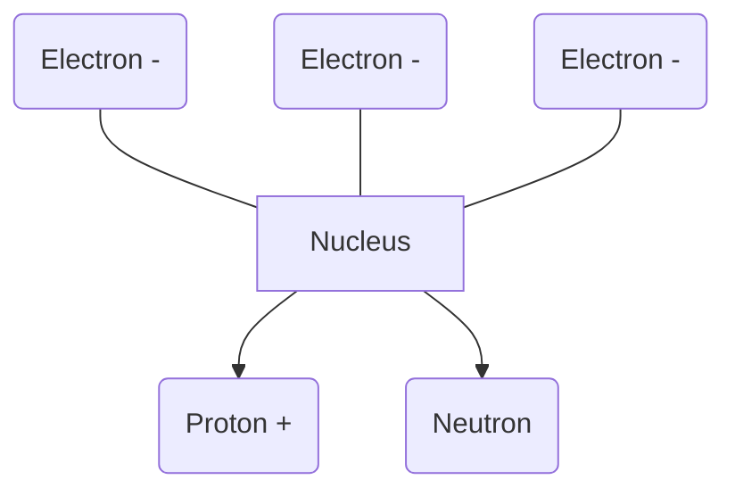
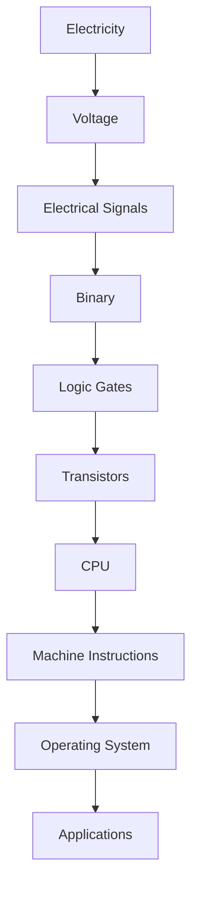

# Electricity

> **Chapter 2 - Foundations**

**Previous:** [01-what-is-a-computer.md](./01-what-is-a-computer.md)  
**Next:** [03-electromagnetic-waves.md](./03-electromagnetic-waves.md)

---

# Table of Contents

- Introduction
- Why Learn Electricity?
- What is Electricity?
- Matter and Atoms
- Atomic Structure
- Electric Charge
- Free Electrons
- Conductors, Insulators and Semiconductors
- Summary

---

# Introduction

Everything inside a computer ultimately depends on electricity.

When you press a key on your keyboard...

Electricity carries that signal.

When your CPU executes an instruction...

Electricity changes the state of billions of transistors.

When your monitor displays an image...

Electricity controls millions of pixels.

When your phone connects to Wi-Fi...

Electricity creates electromagnetic waves that carry information through the air.

Without electricity there would be:

- No CPUs
- No RAM
- No SSDs
- No Internet
- No Mobile Phones
- No Artificial Intelligence

Understanding electricity is the first step toward understanding how computers actually work.

---

# Why Learn Electricity?

Many developers jump directly into programming.

However, every programming language eventually controls hardware.

For example,

```
JavaScript

↓

V8 Engine

↓

Machine Instructions

↓

CPU

↓

Electrical Signals

↓

Transistors
```

Every line of code eventually becomes electrical activity inside the processor.

That is why learning electricity helps us understand computing from first principles.

---

# What is Electricity?

Electricity is the movement of electric charge.

In most electronic devices, the moving charge is carried by **electrons**.

Imagine a water pipe.

Water flows through the pipe.

Similarly,

Electrons flow through a wire.

```
Water Pipe

~~~~~~~~~~~~~~>

Water Flow
```

```
Copper Wire

oooooooooooooo>

Electron Flow
```

This movement of electrons is called **electric current**.

---

# Matter

Everything around us is made of matter.

Examples include:

- Air
- Water
- Wood
- Plastic
- Copper
- Iron
- Gold
- Your Computer
- Your Phone

Matter is made of extremely tiny particles called **atoms**.

---

# Atom

Atoms are the basic building blocks of matter.

Imagine zooming into a piece of copper.

```
Copper

↓

Small Piece

↓

Smaller Piece

↓

Tiny Particle

↓

Atom
```

Everything physical is built from atoms.

Examples:

- CPU
- Motherboard
- RAM
- Human Body
- Earth
- Stars

---

# Structure of an Atom

An atom has three main particles.

| Particle | Charge       |
| -------- | ------------ |
| Proton   | Positive (+) |
| Electron | Negative (-) |
| Neutron  | Neutral (0)  |

---



The center is called the **nucleus**.

The nucleus contains:

- Protons
- Neutrons

Electrons exist around the nucleus.

---

# Proton

A proton has a positive electric charge.

```
+
```

Protons remain tightly packed inside the nucleus.

They normally do not move in electrical circuits.

---

# Electron

Electrons have a negative charge.

```
-
```

Unlike protons, some electrons can move freely.

These moving electrons create electricity.

This is the most important idea in this chapter.

> Electricity in wires is primarily the movement of electrons.

---

# Neutron

Neutrons have no electric charge.

```
0
```

Their primary role is helping stabilize the nucleus.

They do not directly participate in electrical current.

---

# Electric Charge

Electric charge is a property of matter.

There are only two types of charge.

| Charge   | Symbol |
| -------- | ------ |
| Positive | +      |
| Negative | -      |

Opposite charges attract.

```
+    -

Attract
```

Like charges repel.

```
+     +

Repel
```

```
-     -

Repel
```

These simple rules explain many electrical behaviors.

---

# Free Electrons

Not every electron can move.

Some electrons are tightly attached to atoms.

Others can move from one atom to another.

These are called **free electrons**.


When millions or billions of free electrons move together, we get electric current.

---

# Conductors

A conductor allows electrons to move easily.

Examples:

- Copper
- Silver
- Gold
- Aluminum

Because electrons move freely, conductors are used for wires.

Examples:

- USB Cable
- Charging Cable
- Motherboard Traces
- Ethernet Cable

---

# Insulators

Insulators prevent electrons from moving easily.

Examples:

- Rubber
- Plastic
- Glass
- Dry Wood
- Air

That is why electrical wires are covered with plastic.

The copper carries electricity.

The plastic protects us from it.

---

# Semiconductors

Semiconductors are special materials.

They are neither good conductors nor good insulators.

Examples:

- Silicon
- Germanium

Semiconductors can behave like conductors or insulators depending on how they are designed.

This unique property allows engineers to create:

- Transistors
- CPUs
- GPUs
- RAM
- SSD Controllers

Almost every modern electronic device is built from silicon.

Later chapters will explain how billions of tiny silicon transistors form a CPU.

---

# Real World Example

Imagine pressing the power button on your computer.

```
Finger

↓

Power Button

↓

Power Supply

↓

Motherboard

↓

CPU

↓

RAM

↓

Screen Turns On
```

Every step involves electricity flowing through carefully designed circuits.

Nothing inside the computer moves mechanically.

Instead, billions of electrical signals travel every second.

---

# Key Takeaways

- Electricity is the movement of electric charge.
- Electrons carry electrical current.
- Matter is made of atoms.
- Atoms contain protons, neutrons and electrons.
- Conductors allow electrons to move easily.
- Insulators resist the flow of electrons.
- Semiconductors make modern computers possible.

---

# Why Do Electrons Move?

In the previous section, we learned that electricity is the movement of electrons.

A natural question is:

> If electrons are already inside a wire, why would they start moving?

The answer is **electrical potential difference**, commonly known as **voltage**.

Imagine placing a ball on a flat floor.

```text
O
```

The ball stays still because nothing is pushing it.

Now place the ball on top of a hill.

```text
      O
     /\
    /  \
___/____\____
```

The ball rolls downhill because there is a difference in height.

Electricity behaves similarly.

Instead of a **difference in height**, electricity uses a **difference in electrical potential**.

This difference creates a force that pushes electrons.

---

# Voltage

Voltage is the difference in electrical potential between two points.

It is measured in **Volts (V)**.

Think of voltage as **pressure**.

A higher voltage creates a stronger push on electrons.

Imagine a water tank.

```text
      Water Tank
   +-------------+
   |             |
   |             |
   +-------------+
          |
          |
          V
```

The higher the water level, the greater the water pressure.

Electricity behaves in a similar way.

Higher voltage means greater electrical pressure.

Examples:

| Device                   | Voltage |
| ------------------------ | ------- |
| AA Battery               | 1.5 V   |
| Car Battery              | 12 V    |
| USB Port                 | 5 V     |
| Laptop Charger           | 20 V    |
| Household Outlet (India) | 230 V   |

---

# Current

Voltage pushes electrons.

Current measures **how many electrons are actually moving**.

Current is measured in **Amperes (A)**.

Think of a water pipe.

```text
========>

Water Flow
```

More water flowing every second means a larger flow.

Similarly,

More electrons flowing every second means a larger electric current.

---

## Voltage vs Current

Many beginners confuse these two concepts.

A useful analogy is:

| Water System   | Electrical System |
| -------------- | ----------------- |
| Water Pressure | Voltage           |
| Water Flow     | Current           |

Pressure pushes water.

Voltage pushes electrons.

Flow measures how much water moves.

Current measures how many electrons move.

---

# Resistance

Not every material allows electrons to move freely.

Some materials slow them down.

This property is called **Resistance**.

Resistance is measured in **Ohms (Ω)**.

Imagine three water pipes.

```text
Wide Pipe

========>

Water flows easily
```

```text
Narrow Pipe

==>

Water flows slowly
```

A narrow pipe creates more resistance.

Electricity behaves similarly.

A thin wire or certain materials resist electron movement.

---

# The Three Fundamental Quantities

Every electrical circuit can be understood using three quantities.

| Quantity   | Symbol | Unit   |
| ---------- | ------ | ------ |
| Voltage    | V      | Volt   |
| Current    | I      | Ampere |
| Resistance | R      | Ohm    |

Almost every electronic device depends on these three values.

---

# Ohm's Law

One of the most important equations in electronics is **Ohm's Law**.

```text
V = I × R
```

Where:

- V = Voltage
- I = Current
- R = Resistance

This simple equation helps engineers design everything from phone chargers to CPUs.

Example:

```
Voltage = 12 V

Resistance = 6 Ω

Current = ?
```

Using Ohm's Law,

```
I = V / R

I = 12 / 6

I = 2 A
```

---

# Power

Electrical power represents how much electrical energy is used every second.

Power is measured in **Watts (W)**.

Formula:

```text
Power = Voltage × Current

P = V × I
```

Example:

A USB charger provides

```
5 V

2 A
```

Power is

```
P = 5 × 2

P = 10 Watts
```

---

# Energy

Power tells us how fast energy is used.

Energy tells us **how much work has been done over time**.

Examples:

- Phone battery
- Laptop battery
- Electric vehicle battery

Common units:

- Joule (J)
- Watt-hour (Wh)
- Kilowatt-hour (kWh)

Electricity bills are measured in **kWh**.

---

# Direct Current (DC)

In Direct Current (DC), electrons move in one direction.

```text
Battery

+ --------->
```

Examples:

- Mobile Phone
- Laptop
- Power Bank
- Raspberry Pi
- Arduino

Almost every computer component internally uses DC power.

---

# Alternating Current (AC)

In Alternating Current, the direction continuously changes.

```text
<-------->

--------->

<-------->

--------->
```

This is the electricity supplied to homes.

Examples:

- Household Power Outlet
- Office Buildings
- Factories

India uses approximately **230 V AC at 50 Hz**.

---

# Why Computers Convert AC to DC

When you plug a desktop computer into a wall socket:

```text
Wall Socket (AC)

↓

Power Supply (SMPS)

↓

DC Voltages

↓

Motherboard

↓

CPU

↓

RAM
```

The CPU cannot operate directly on household AC power.

The computer's **SMPS (Switched-Mode Power Supply)** converts AC into multiple stable DC voltages required by different components.

---

# Digital Electronics

Electricity in computers is different from electricity used to power a fan or heater.

Instead of using continuously changing values, computers primarily use **two voltage ranges**.

They represent:

```text
LOW

HIGH
```

Later we call these

```
0

1
```

Everything inside a CPU is ultimately represented using these two electrical states.

This idea forms the basis of **Binary**, which is the next major chapter after electromagnetic waves.

---

# Electrical Signals

A computer does not think using words.

It thinks using electrical signals.

For example,

```text
HIGH

LOW

HIGH

HIGH

LOW
```

These voltage changes travel through tiny metal traces on the motherboard.

Modern CPUs generate **billions of these signals every second**.

---

# From Electricity to Computing

The journey from electricity to software looks like this:



Everything you do on a computer ultimately begins with electricity.

---

# Common Misconceptions

## Electricity moves at the speed of light.

Not exactly.

The **electrical signal** travels close to the speed of light inside a conductor.

The **individual electrons** move much more slowly.

This distinction is important and will be explored in later chapters.

---

## Voltage is electricity.

Incorrect.

Voltage is not electricity.

Voltage is the **potential difference** that pushes electrons.

Current is the actual movement of charge.

---

## Higher voltage is always dangerous.

Not always.

Danger depends on multiple factors including:

- Voltage
- Current
- Duration
- Path through the body

Both voltage and current matter.

---

# Summary

In this section, we learned the core quantities used in electrical engineering:

- Voltage pushes electrons.
- Current measures the flow of electrons.
- Resistance opposes that flow.
- Power measures the rate of energy transfer.
- Computers internally use Direct Current (DC).
- Household electricity is Alternating Current (AC).
- Every computation begins as an electrical signal.
- Binary, logic gates, and CPUs are all built on these electrical principles.

---

# Coming Next

Now that we understand how electricity flows through wires, we can answer another important question:

> **How can electricity travel through empty space without wires?**

The answer lies in **electromagnetic waves**.

In the next chapter, we'll learn how radio waves, Wi-Fi, Bluetooth, 4G, 5G, GPS, and satellite communication all work using the same fundamental physical principle.
