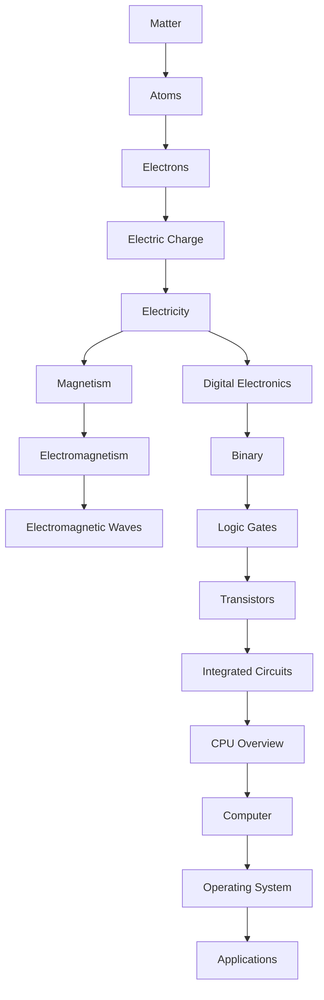

# Foundations

The **Foundations** section introduces the fundamental concepts behind computers and modern computing. The goal is to build knowledge from first principles, starting with matter and electricity, progressing through digital electronics and computer architecture, and ultimately understanding how software runs on hardware.

This section is intended for anyone who wants to understand **how computers actually work**, from the movement of electrons to the execution of applications.

---

# Learning Objectives

After completing this section, you should be able to:

- Explain what a computer is and how it processes information.
- Understand the structure of matter and atoms.
- Describe how electricity flows through a circuit.
- Explain voltage, current, resistance, and power.
- Understand magnetism and electromagnetism.
- Explain how electromagnetic waves enable communication technologies.
- Understand how electrical signals represent digital information.
- Explain why computers use binary.
- Understand how logic gates perform computation.
- Describe how transistors implement logic gates.
- Explain how integrated circuits are built.
- Understand the high-level architecture of a CPU.
- Build a strong foundation for learning operating systems, networking, programming languages, browsers, React, React Native, Electron, and system design.

---

# Chapters

| No. | Chapter               | Description                                                                                   |
| --: | --------------------- | --------------------------------------------------------------------------------------------- |
|  01 | What is a Computer    | Introduction to computers, hardware, software, and the IPO (Input–Process–Output) cycle.      |
|  02 | Matter and Atoms      | Learn about matter, atoms, protons, neutrons, electrons, and electric charge.                 |
|  03 | Electricity           | Understand voltage, current, resistance, power, AC, DC, and electrical circuits.              |
|  04 | Magnetism             | Learn magnetic fields, permanent magnets, electromagnets, and magnetic force.                 |
|  05 | Electromagnetism      | Explore the relationship between electricity and magnetism and how they influence each other. |
|  06 | Electromagnetic Waves | Learn how radio waves, Wi-Fi, Bluetooth, GPS, 4G, 5G, and satellites communicate.             |
|  07 | Digital Electronics   | Understand analog vs digital signals, voltage levels, clocks, and digital circuits.           |
|  08 | Binary                | Learn the binary number system, bits, bytes, hexadecimal, and data representation.            |
|  09 | Logic Gates           | Study AND, OR, NOT, XOR, NAND, NOR, truth tables, and Boolean logic.                          |
|  10 | Transistors           | Learn how transistors work and how they act as electronic switches.                           |
|  11 | Integrated Circuits   | Understand how millions and billions of transistors are combined into chips.                  |
|  12 | CPU Overview          | Learn how the CPU fetches, decodes, and executes instructions at a high level.                |

---

# Learning Flow

The chapters are intentionally ordered so that each topic builds upon the previous one.



> **Note:** This diagram represents a **learning progression**, not a strict scientific dependency. It shows the recommended order for understanding modern computing from the physical world up to software.

---

# Where This Leads

The concepts learned in this section provide the foundation for the rest of the documentation.

```text
Foundations
      │
      ▼
Computer Architecture
      │
      ▼
Operating Systems
      │
      ▼
Networking
      │
      ▼
Programming Languages
      │
      ▼
JavaScript Engine
      │
      ▼
Node.js
      │
      ▼
Browser
      │
      ▼
React
      │
      ▼
React Native
      │
      ▼
Electron
      │
      ▼
Docker
      │
      ▼
System Design
```

---

# Prerequisites

No prior knowledge is required.

This section starts from the most fundamental concepts and gradually builds toward modern computer systems.

---

# Next Chapter

Continue with **Chapter 01 – What is a Computer**.
