# Chapter 1: Introduction to Computers

> **Foundations**

**Previous:** None  
**Next:** [Chapter 2 – Matter and Atoms](./02-matter-and-atoms.md)

---

# Table of Contents

1. Introduction
2. Why Study Computers?
3. What is a Computer?
4. Evolution of Computers
5. Characteristics of a Computer
6. Data and Information
7. The IPO Cycle
8. Types of Computers
9. Components of a Computer
10. Hardware and Software
11. The Big Picture
12. Summary
13. Glossary
14. Review Questions

---

# Introduction

Look around you.

Almost every modern device contains a computer.

Your phone is a computer.

Your smartwatch is a computer.

Your television contains one or more computers.

Cars contain dozens of computers.

ATMs are computers.

Game consoles are computers.

Even a modern refrigerator or washing machine contains a small computer called an **embedded system**.

Computers have become the foundation of modern civilization.

They help us communicate, learn, work, travel, entertain ourselves, perform scientific research, and even explore space.

Before learning programming, operating systems, networking, or application development, it is important to understand what a computer actually is and why it exists.

This chapter introduces the fundamental ideas that every software engineer should know.

---

# Why Study Computers?

Most developers begin by learning a programming language.

For example:

- JavaScript
- Python
- Java
- C++
- Go
- Rust

After writing a few programs, everything seems to work like magic.

You write:

```javascript
console.log("Hello, World!");
```

The text appears on the screen.

But what actually happened?

How did your source code become electrical signals?

How did the CPU execute those instructions?

How did millions of pixels on your monitor change to display the text?

How did the keyboard send your keystrokes to the computer?

These questions cannot be answered by learning a programming language alone.

To truly understand software, we must first understand the machine that executes it.

This documentation starts from the lowest practical level and gradually builds upward until we reach modern software systems.

---

# Learning Journey

Throughout this documentation, we will move from the physical world to software.

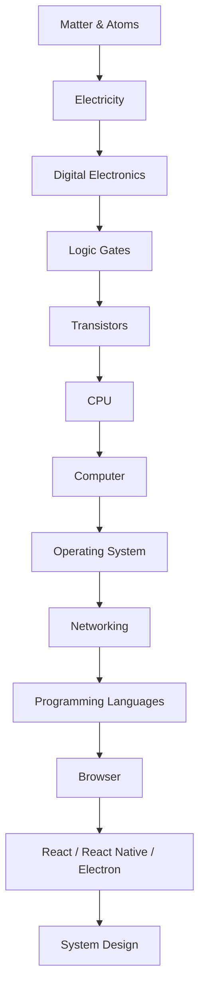

Every chapter builds on the previous one.

By the end of this journey, you'll understand not only **how to build software**, but also **how the entire computing stack works**, from electrons moving inside silicon to applications running on millions of devices.

---

# What is a Computer?

A **computer** is an electronic machine that accepts input, processes data according to a set of instructions, stores information, and produces output.

The instructions that tell a computer what to do are called **programs**.

Programs are written using programming languages and eventually translated into machine instructions that the processor can execute.

At its core, every computer performs four fundamental operations:

1. Accept input.
2. Process data.
3. Store data.
4. Produce output.

These four operations form the basis of all computing systems.

---

# The Input–Process–Output Cycle

Every computer system follows the same basic workflow.

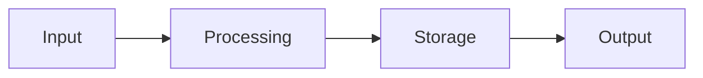

Let's look at a simple example.

Suppose you open a calculator application and enter:

```text
25 + 17
```

The sequence of events is:

1. You type the numbers using the keyboard.
2. The calculator receives the input.
3. The CPU performs the addition.
4. The result is stored temporarily in memory.
5. The monitor displays the answer.

Although this example is simple, the same process occurs in every application—from a calculator to a web browser or a game.

---

# Real-World Example: Watching a YouTube Video

Let's examine a more complex example.

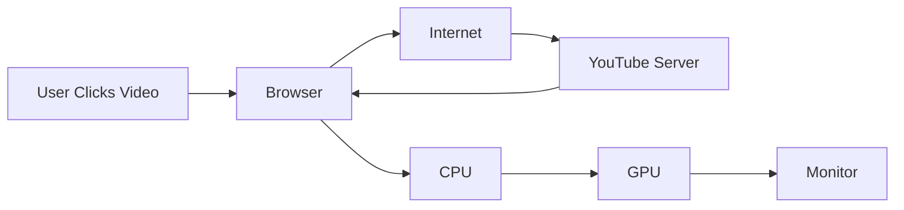

Many hardware and software components work together to complete a task that takes only a fraction of a second.

Understanding how these components cooperate is one of the main goals of this documentation.

---

---

# Evolution of Computers

Computers have not always looked like the devices we use today. Over time, they have evolved from room-sized machines to powerful devices that fit in our pockets.

Understanding this evolution helps us appreciate why modern computers are designed the way they are.

## Early Mechanical Computers

Long before electronic computers existed, humans used mechanical devices to perform calculations.

Examples include:

- Abacus
- Pascaline
- Difference Engine
- Analytical Engine

Although these machines were limited, they introduced the idea that calculations could be automated.

---

## Electronic Computers

The invention of electronic components transformed computing.

Early computers used:

- Vacuum Tubes

Later generations used:

- Transistors

Modern computers use:

- Integrated Circuits (ICs)

Today's processors contain **billions of transistors** on a single chip.

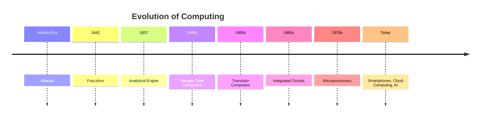

> **Note:** The timeline above highlights major milestones rather than every development in computing history.

---

# Characteristics of a Computer

Although computers vary in size and performance, they share several important characteristics.

## 1. Speed

Computers perform operations incredibly fast.

Modern processors execute billions of instructions every second.

For example:

- Opening an application
- Playing a video
- Running a game
- Performing AI inference

All of these involve millions or billions of calculations.

---

## 2. Accuracy

A computer follows instructions exactly.

If the program and input are correct, the output will also be correct.

When incorrect results occur, the cause is usually one of the following:

- Incorrect program
- Incorrect input
- Hardware failure

The computer itself does not "guess."

---

## 3. Automation

Once given instructions, a computer executes them automatically.

For example:

A web server can process requests continuously without human intervention.

An operating system automatically manages memory, schedules processes, and communicates with hardware.

---

## 4. Storage

Computers can store large amounts of information.

Examples include:

- Documents
- Photos
- Videos
- Music
- Applications
- Databases

Some information is stored temporarily (RAM), while other information is stored permanently (SSD or HDD).

We'll study these in later chapters.

---

## 5. Versatility

A single computer can perform many different tasks simply by changing the software.

For example, the same laptop can be used for:

- Programming
- Gaming
- Video Editing
- Music Production
- Browsing the Internet
- Artificial Intelligence

The hardware remains mostly the same, but the software determines the task.

---

# Data and Information

These two terms are often used interchangeably, but they have different meanings.

## Data

Data refers to raw, unprocessed facts.

Examples:

```text
42
```

```text
Alice
```

```text
91
```

```text
2026-07-15
```

By themselves, these values have little meaning.

---

## Information

Information is processed data that has context and meaning.

Example:

```text
Alice scored 91 marks on 15 July 2026.
```

Now the data tells a meaningful story.


---

# Example: Online Shopping

Suppose you visit an e-commerce website.

You select:

- Product Price = ₹999
- Quantity = 3

The application performs a calculation:

```text
999 × 3 = 2997
```

The result becomes useful information:

```text
Total Amount: ₹2997
```

The same idea applies to every software application.

Whether you're using:

- Google Maps
- Instagram
- ChatGPT
- WhatsApp
- Netflix

Each application receives data, processes it, and presents meaningful information to the user.

---

# Information Processing in Everyday Life

Consider what happens when you search for:

```text
best laptops under ₹80,000
```

A simplified flow looks like this:

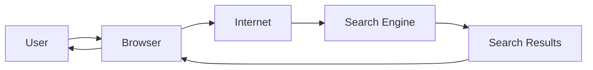

Behind the scenes, millions of calculations are performed before the results appear on your screen.

---

# Why Computers Use Programs

Imagine asking someone to bake a cake.

If you simply say:

> "Bake a cake."

The result may vary.

Instead, you provide a recipe:

1. Mix ingredients.
2. Preheat the oven.
3. Bake for 30 minutes.
4. Let it cool.

The recipe tells the baker exactly what to do.

A computer works the same way.

A **program** is simply a set of instructions that tells the computer what steps to perform.

Programs can be written in languages such as:

- C
- C++
- Java
- Python
- JavaScript
- Rust
- Go

Later in this documentation, we'll learn how these high-level languages are translated into machine instructions that the CPU can execute.

---

# Key Takeaways

- Computers have evolved from mechanical devices to highly integrated electronic systems.
- Modern computers are fast, accurate, automated, and versatile.
- Data consists of raw facts, while information is processed data with meaning.
- Every computer application follows the same general pattern:
  - Receive data
  - Process data
  - Produce information
- Programs provide the instructions that tell a computer how to process data.

---

---

# Components of a Computer

Although computers come in many different forms, they all contain a set of fundamental components that work together to perform computations.

Think of a computer as a team.

Each member has a specific responsibility.

No single component can perform every task alone.

Together, they create a complete computing system.

The major components of a computer are:

- Motherboard
- Central Processing Unit (CPU)
- Memory (RAM)
- Storage (SSD / HDD)
- Graphics Processing Unit (GPU)
- Power Supply
- Input Devices
- Output Devices
- Network Interface

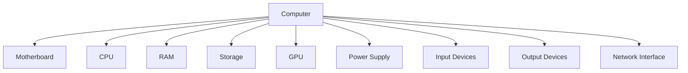

Each of these components will be explored in detail in later chapters.

For now, we'll build a high-level understanding of their purpose.

---

# Motherboard

The **motherboard** is the main circuit board of a computer.

Almost every hardware component connects to the motherboard.

Its primary responsibility is to allow all components to communicate with one another.

Without a motherboard:

- The CPU cannot access RAM.
- The SSD cannot send data.
- USB devices cannot communicate.
- The GPU cannot receive rendering commands.

You can think of the motherboard as a city's road network.

```text
City
│
├── Roads
├── Bridges
├── Traffic Signals
└── Highways
```

Just as roads connect buildings in a city, the motherboard connects hardware components inside a computer.

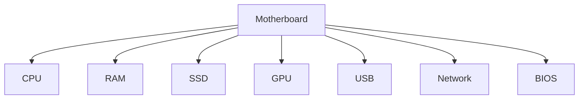

The motherboard does very little computation itself.

Instead, it provides the infrastructure that allows other components to exchange information.

---

# Central Processing Unit (CPU)

The **Central Processing Unit**, or **CPU**, is often called the **brain of the computer**.

Its primary job is to execute instructions.

Examples of instructions include:

- Add two numbers.
- Compare two values.
- Read data from memory.
- Write data to memory.
- Make decisions.
- Jump to another instruction.

Every application eventually becomes a sequence of CPU instructions.

For example:

```text
Calculator

↓

Operating System

↓

CPU Instructions

↓

Electrical Signals

↓

Result
```

Modern CPUs execute billions of instructions every second.

Although the CPU performs calculations, it does **not** permanently store programs or files.

Instead, it works closely with memory and storage.

---

# Memory (RAM)

RAM stands for **Random Access Memory**.

It is the computer's temporary working memory.

Whenever you open an application, the operating system loads it into RAM.

For example:

```text
SSD

↓

RAM

↓

CPU
```

The CPU executes instructions directly from RAM because RAM is much faster than long-term storage.

Characteristics of RAM:

- Very fast
- Temporary
- Volatile (data is lost when power is removed)

Imagine your desk while studying.

Books that you're currently reading are placed on the desk because they are easy to access.

The bookshelf represents long-term storage.

Your desk represents RAM.

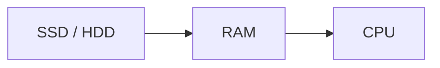

---

# Storage

Storage is responsible for permanently saving data.

Unlike RAM, storage retains information even after the computer is powered off.

Examples of stored data include:

- Operating System
- Applications
- Photos
- Videos
- Documents
- Music
- Games

Common storage devices include:

- Solid State Drive (SSD)
- Hard Disk Drive (HDD)
- USB Flash Drive
- Memory Card

Whenever an application starts, it is copied from storage into RAM before the CPU begins executing it.

---

# Graphics Processing Unit (GPU)

The **Graphics Processing Unit (GPU)** specializes in graphics-related computations.

Originally, GPUs were designed to render images for games and graphical applications.

Today, GPUs are also widely used for:

- Artificial Intelligence
- Machine Learning
- Scientific Simulations
- Video Rendering
- Cryptocurrency Mining

Unlike a CPU, which is optimized for many different types of work, a GPU is optimized to perform many similar calculations in parallel.

For example:

- Drawing millions of pixels
- Processing thousands of vertices in a 3D scene
- Performing matrix operations for AI models

Modern computers often contain both a CPU and a GPU, each handling different workloads.

---

# Power Supply

Every component inside a computer requires electrical power.

The **Power Supply Unit (PSU)** converts electricity from the wall outlet into stable voltages that the computer's components can safely use.

For desktop computers, the flow looks like this:

```text
Wall Outlet (AC)

↓

Power Supply

↓

Motherboard

↓

CPU
RAM
GPU
Storage
```

Without a power supply, none of the hardware can operate.

We'll learn more about electrical power in later chapters.

---

# Input Devices

Input devices allow users or other systems to provide data to the computer.

Examples include:

| Device       | Purpose             |
| ------------ | ------------------- |
| Keyboard     | Enter text          |
| Mouse        | Control the pointer |
| Touch Screen | Touch input         |
| Camera       | Capture images      |
| Microphone   | Capture audio       |
| Scanner      | Read documents      |

Every input device converts a physical action into digital information that the computer can process.

---

# Output Devices

Output devices present the results produced by the computer.

Examples include:

| Device     | Output            |
| ---------- | ----------------- |
| Monitor    | Images and text   |
| Printer    | Printed documents |
| Speaker    | Audio             |
| Headphones | Audio             |
| Projector  | Large display     |

Output devices make the computer's work visible or audible to users.

---

# Network Interface

Modern computers rarely work alone.

They communicate with other computers through a network.

Network hardware enables this communication.

Examples include:

- Ethernet Adapter
- Wi-Fi Adapter
- Bluetooth Module
- Cellular Modem

Network communication makes possible:

- Internet browsing
- Video calls
- Online gaming
- Cloud computing
- File sharing

Without networking, computers would operate in isolation.

---

# How the Components Work Together

Suppose you double-click a web browser.

Many components cooperate to perform this seemingly simple action.

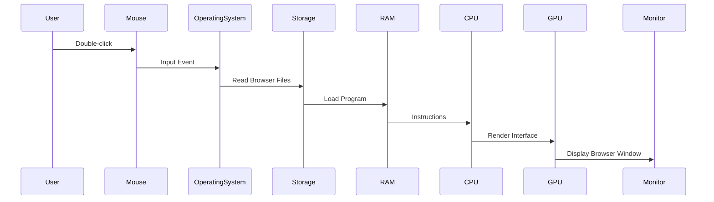

Although this process happens in less than a second, every major hardware component participates.

This cooperation between specialized components is one of the reasons computers are both powerful and efficient.

---

# Key Takeaways

- Every computer consists of several specialized hardware components.
- The motherboard connects all major components.
- The CPU executes instructions.
- RAM stores data temporarily while programs are running.
- Storage retains data permanently.
- The GPU accelerates graphics and parallel computation.
- Input devices provide data to the computer.
- Output devices present results to users.
- Network hardware allows computers to communicate with one another.

---

---

# Hardware and Software

Every computer system consists of two major parts:

1. **Hardware**
2. **Software**

Neither is useful without the other.

A computer with only hardware cannot perform meaningful work.

A program without hardware has nowhere to execute.

Together, they form a complete computing system.

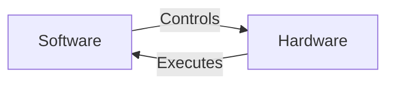

---

# What is Hardware?

**Hardware** refers to the physical components of a computer.

These are the parts that you can physically see and touch.

Examples include:

- Motherboard
- CPU
- RAM
- SSD
- HDD
- GPU
- Keyboard
- Mouse
- Monitor
- Network Card
- Power Supply

If you open a desktop computer, everything inside the cabinet is hardware.

Even external devices like keyboards and printers are hardware.

---

# Examples of Hardware

| Component     | Purpose                  |
| ------------- | ------------------------ |
| CPU           | Executes instructions    |
| RAM           | Temporary working memory |
| SSD           | Permanent storage        |
| GPU           | Graphics processing      |
| Motherboard   | Connects all hardware    |
| Keyboard      | Text input               |
| Mouse         | Pointer input            |
| Monitor       | Displays output          |
| Speakers      | Audio output             |
| Ethernet Card | Network communication    |

---

# What is Software?

Software is a collection of instructions that tells the hardware what to do.

Unlike hardware, software cannot be touched physically.

Software exists as digital information stored on storage devices and loaded into memory when executed.

Examples include:

- Windows
- Linux
- macOS
- Android
- Chrome
- VS Code
- Microsoft Word
- WhatsApp
- React Applications
- Node.js Applications

Every application you use is software.

---

# Categories of Software

Software can be broadly divided into two categories.

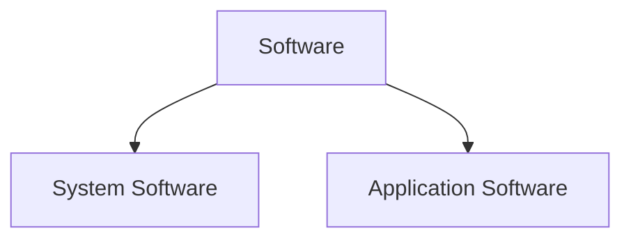

---

# System Software

System software manages the computer itself.

It provides the environment in which applications run.

Examples:

- Operating Systems
- Device Drivers
- Firmware
- Bootloader

Responsibilities include:

- Managing memory
- Scheduling CPU time
- Managing files
- Communicating with hardware
- Managing security
- Running applications

Examples of operating systems include:

- Windows
- Linux
- macOS
- Android
- iOS

---

# Application Software

Application software helps users perform specific tasks.

Examples:

- Chrome
- Firefox
- Microsoft Word
- Adobe Photoshop
- VLC Media Player
- Spotify
- VS Code
- WhatsApp
- Telegram

Unlike system software, application software focuses on solving user problems rather than managing the computer itself.

---

# Firmware

Firmware is a special type of software stored inside hardware devices.

Examples include:

- Motherboard BIOS/UEFI
- SSD Controller Firmware
- Router Firmware
- Smart TV Firmware
- Keyboard Firmware

Firmware usually starts running before the operating system.

We'll study firmware in detail when we learn about the boot process.

---

# Can Hardware Work Without Software?

Imagine a brand-new computer.

It has:

- CPU
- RAM
- SSD
- Motherboard
- Monitor

Now imagine that every bit of software is removed.

There is:

- No BIOS
- No Operating System
- No Applications

The hardware still exists, but it has no instructions to execute.

The computer cannot boot or perform useful work.

Hardware alone is not enough.

---

# Can Software Work Without Hardware?

Now imagine a React application.

Where does it run?

It eventually needs:

- A CPU
- Memory
- Storage
- Display
- Operating System

Without hardware, software cannot execute.

Programs always require hardware.

---

# Real World Example

Suppose you open Visual Studio Code.

What actually happens?

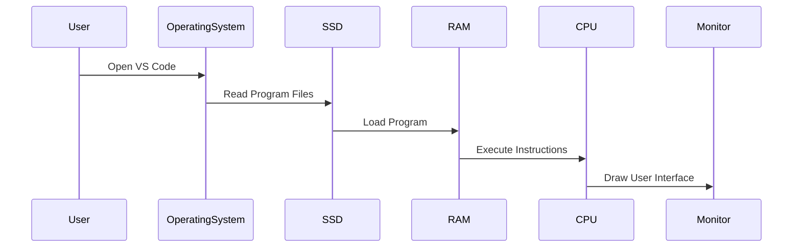

Notice that software never directly controls the monitor or SSD.

Instead, the operating system coordinates communication between the application and the hardware.

---

# The Relationship Between Hardware and Software

The following diagram shows how software is layered on top of hardware.

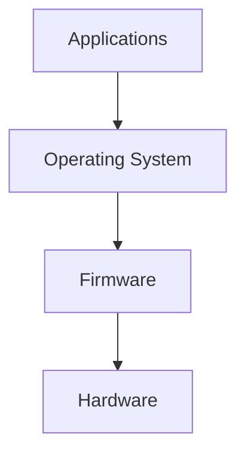

Each layer builds upon the one below it.

Applications rarely communicate directly with hardware.

Instead, they rely on the operating system.

The operating system relies on firmware during startup.

Firmware prepares the hardware before handing control to the operating system.

---

# A Simple Analogy

Imagine a restaurant.

| Restaurant    | Computer         |
| ------------- | ---------------- |
| Customer      | User             |
| Waiter        | Application      |
| Manager       | Operating System |
| Kitchen Staff | CPU              |
| Kitchen       | Hardware         |

The customer places an order.

The waiter delivers it to the kitchen.

The kitchen prepares the meal.

The waiter brings it back.

Similarly,

A user interacts with an application.

The application requests services from the operating system.

The operating system communicates with the hardware.

The hardware performs the requested work.

The result travels back through the same layers until it reaches the user.

---

# Key Takeaways

- Hardware refers to the physical components of a computer.
- Software consists of instructions executed by hardware.
- Hardware and software depend on each other.
- System software manages hardware resources.
- Application software solves user problems.
- Firmware is specialized software stored inside hardware.
- Applications usually communicate with hardware through the operating system.

---

---

# A High-Level View of How a Computer Works

Throughout this chapter, we've discussed the components of a computer individually.

Now let's see how they work together.

Suppose you press the power button on your computer.

Although the entire startup process is complex, the high-level sequence looks like this:

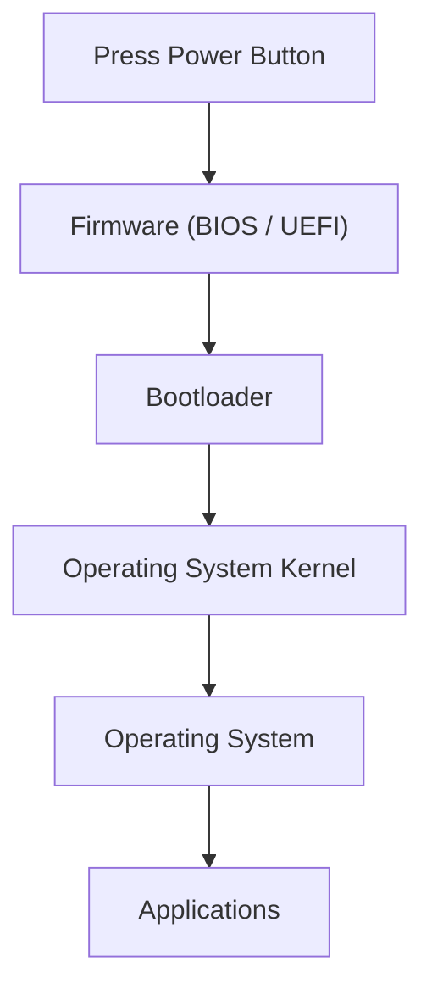

Let's briefly understand each stage.

---

## Step 1 – Power On

When you press the power button, electricity begins flowing through the computer.

The power supply provides stable voltages to the motherboard.

The motherboard powers components such as:

- CPU
- RAM
- Storage
- Graphics Card
- Network Interface

At this moment, the CPU is powered but has no idea what program to execute.

---

## Step 2 – Firmware Starts

Every processor is designed to begin executing instructions from a predefined location after reset.

Those initial instructions belong to the computer's firmware, commonly known as:

- BIOS (older systems)
- UEFI (modern systems)

The firmware performs basic hardware initialization, such as checking memory and detecting storage devices.

Think of firmware as the computer's first instructor.

Its job is to prepare the system for the operating system.

---

## Step 3 – Bootloader

Once the firmware has prepared the hardware, it loads another program called the **bootloader**.

The bootloader's responsibility is to locate the operating system and start it.

Examples include:

- Windows Boot Manager
- GRUB
- systemd-boot

At this point, the operating system is still not running.

---

## Step 4 – Operating System Kernel

The bootloader loads the operating system kernel into memory.

The kernel is the core part of the operating system.

It is responsible for managing:

- CPU
- Memory
- Storage
- Devices
- Processes
- Security

Everything that happens after this point is coordinated by the kernel.

---

## Step 5 – Operating System

Once the kernel has initialized the system, the operating system starts additional services.

Examples include:

- Display Manager
- Login Screen
- Background Services
- Network Services
- File System Services

Eventually, the desktop environment or home screen appears.

The computer is now ready for the user.

---

## Step 6 – Applications

Applications run on top of the operating system.

Examples:

- Chrome
- VS Code
- WhatsApp
- Games
- Music Players

Applications request services from the operating system rather than interacting directly with hardware in most cases.

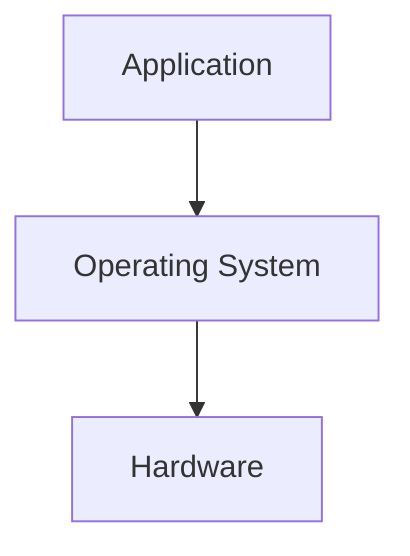

---

# Putting Everything Together

Let's combine everything we've learned so far into one simplified diagram.

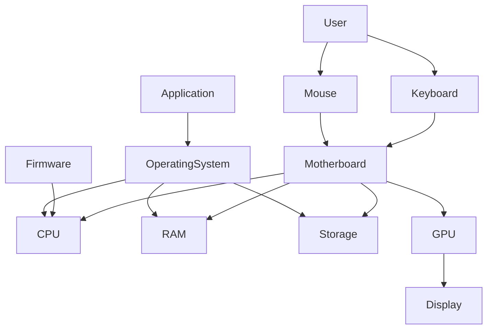

This diagram is intentionally simplified.

As you continue through this documentation, we'll revisit it multiple times and replace each high-level box with increasingly detailed explanations.

---

# What We Will Learn Next

So far, we've answered questions like:

- What is a computer?
- What are its major components?
- What is the difference between hardware and software?
- How does a computer start at a high level?

However, we still haven't answered one of the most fundamental questions:

> **How can hardware actually perform computation?**

A CPU is made of silicon.

RAM is made of silicon.

A motherboard is made of copper, fiberglass, and other materials.

How can these physical materials process information?

To answer that, we must go much deeper.

We'll begin by studying the building blocks of matter itself.

In the next chapter, we'll explore:

- Matter
- Atoms
- Protons
- Neutrons
- Electrons
- Electric Charge

These concepts form the foundation of electricity, electronics, and modern computing.

---

# Summary

In this chapter, we built a high-level understanding of computers.

We learned:

- What a computer is.
- Why computers exist.
- The Input–Process–Output cycle.
- The major hardware components of a computer.
- The difference between hardware and software.
- A simplified overview of the startup process.

At this point, you should not worry about understanding every detail.

The purpose of this chapter was to build a mental model that we'll refine throughout the rest of this documentation.

Every chapter that follows will zoom in on one part of this model and explain it in depth.

---

# Review Questions

1. What is a computer?
2. What are the four basic operations performed by every computer?
3. What is the difference between data and information?
4. What is the role of the motherboard?
5. Why is RAM different from storage?
6. Why can't software run without hardware?
7. What is the purpose of an operating system?
8. What happens immediately after you press the power button?
9. Why does the CPU need RAM?
10. Why do applications generally rely on the operating system to access hardware?

---

# Next Chapter

➡️ **Chapter 2 – Matter and Atoms**
