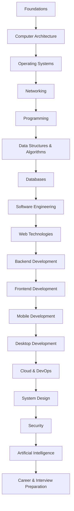

# Learning Roadmap

This documentation is designed to teach modern computing from first principles.

Instead of learning technologies in isolation, each section builds upon the previous one, creating a complete understanding of how computers and software systems work.

---

# Learning Path



---

# Documentation Structure

```
docs/
│
├── 01-foundations/
├── 02-computer-architecture/
├── 03-operating-systems/
├── 04-networking/
├── 05-programming/
├── 06-data-structures-algorithms/
├── 07-databases/
├── 08-software-engineering/
├── 09-web-technologies/
├── 10-backend/
├── 11-frontend/
├── 12-mobile/
├── 13-desktop/
├── 14-cloud-devops/
├── 15-system-design/
├── 16-security/
├── 17-artificial-intelligence/
└── 18-career/
```

---

# 01. Foundations

Build an understanding of computers from the physical world upward.

Topics include:

- Introduction to Computers
- Matter and Atoms
- Electricity
- Magnetism
- Electromagnetism
- Electromagnetic Waves
- Digital Electronics
- Binary
- Logic Gates
- Transistors
- Integrated Circuits
- Processor Architecture Overview

---

# 02. Computer Architecture

Understand how hardware is organized.

Topics include:

- Motherboard
- CPU
- ALU
- Control Unit
- Registers
- Clock
- Instruction Cycle
- Cache
- RAM
- ROM
- Storage
- GPU
- PCIe
- USB
- Buses
- Interrupts
- DMA
- Power Management

---

# 03. Operating Systems

Understand how software manages hardware.

Topics include:

- What is an Operating System?
- BIOS vs UEFI
- Boot Process
- Bootloader
- Kernel
- User Space vs Kernel Space
- Processes
- Threads
- Scheduling
- Context Switching
- Memory Management
- Virtual Memory
- Paging
- File Systems
- System Calls
- Signals
- Device Drivers

---

# 04. Networking

Learn how computers communicate.

Topics include:

- Network Fundamentals
- OSI Model
- TCP/IP
- IPv4
- IPv6
- MAC Address
- Switching
- Routing
- DNS
- DHCP
- HTTP
- HTTPS
- TLS
- WebSocket
- QUIC
- HTTP/3
- VPN
- CDN
- Load Balancing

---

# 05. Programming

Learn how software is created and executed.

Topics include:

- Programming Paradigms
- Compilation
- Interpretation
- Assemblers
- Linkers
- Runtime
- Memory Layout
- Stack
- Heap
- Garbage Collection
- Virtual Machines
- JavaScript Engine
- V8
- Node.js Runtime

---

# 06. Data Structures & Algorithms

Topics include:

- Arrays
- Linked Lists
- Stacks
- Queues
- Trees
- Graphs
- Hash Tables
- Heaps
- Searching
- Sorting
- Dynamic Programming
- Recursion
- Complexity Analysis

---

# 07. Databases

Topics include:

- Relational Databases
- NoSQL
- SQL
- Transactions
- ACID
- Indexes
- Query Optimization
- MongoDB
- PostgreSQL
- Redis
- Elasticsearch
- Replication
- Sharding

---

# 08. Software Engineering

Topics include:

- Software Development Lifecycle
- Design Principles
- SOLID
- Clean Code
- Refactoring
- Documentation
- Git
- Testing
- Logging
- Debugging
- Architecture Decision Records
- CI/CD Basics

---

# 09. Web Technologies

Topics include:

- Internet
- Browser
- HTML
- CSS
- JavaScript
- DOM
- CSSOM
- Rendering Pipeline
- Event Loop
- Web APIs
- Browser Storage
- Service Workers
- PWAs

---

# 10. Backend Development

Topics include:

- REST APIs
- GraphQL
- Authentication
- Authorization
- Sessions
- JWT
- File Uploads
- Background Jobs
- Message Queues
- Caching
- Rate Limiting
- API Design

---

# 11. Frontend Development

Topics include:

- React
- State Management
- Routing
- Rendering
- SSR
- CSR
- SSG
- Hydration
- Performance
- Accessibility

---

# 12. Mobile Development

Topics include:

- React Native
- Native Modules
- JSI
- Fabric
- TurboModules
- Navigation
- Performance
- Offline Storage
- Push Notifications

---

# 13. Desktop Development

Topics include:

- Electron
- Chromium
- Main Process
- Renderer Process
- IPC
- Native Integrations
- Auto Updates
- Packaging

---

# 14. Cloud & DevOps

Topics include:

- Linux
- Shell
- Docker
- Kubernetes
- Nginx
- Reverse Proxy
- CI/CD
- AWS
- Monitoring
- Logging
- Scaling

---

# 15. System Design

Topics include:

- Scalability
- CAP Theorem
- Consistency
- Availability
- Partition Tolerance
- Microservices
- Event-Driven Architecture
- CQRS
- Event Sourcing
- Distributed Systems
- Load Balancing
- Caching

---

# 16. Security

Topics include:

- Cryptography
- Hashing
- Encryption
- OAuth
- JWT Security
- HTTPS
- XSS
- CSRF
- SQL Injection
- Secure Coding
- Secrets Management

---

# 17. Artificial Intelligence

Topics include:

- Machine Learning Fundamentals
- Neural Networks
- Transformers
- Large Language Models
- Embeddings
- Vector Databases
- RAG
- AI Agents
- Model Deployment

---

# 18. Career

Topics include:

- Resume
- Portfolio
- Open Source
- Interview Preparation
- System Design Interviews
- Behavioral Interviews
- Salary Negotiation
- Career Growth

---

# Goal

By completing this roadmap, you should understand how a user action—such as clicking a button in a React Native app—travels through the entire stack:

- The display detects the touch.
- The hardware generates electrical signals.
- The operating system processes the input.
- React Native receives the event.
- JavaScript executes.
- A network request is sent.
- The backend processes the request.
- The database stores or retrieves data.
- A response is returned.
- The UI updates on the screen.

Rather than learning isolated technologies, you'll understand how every layer of the computing stack works together.
